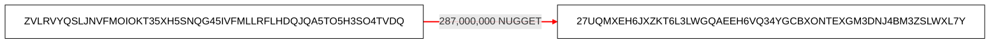
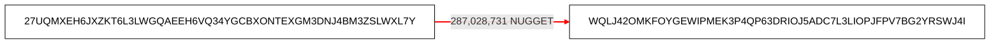

```mermaid
flowchart LR

    ZVLRVYQSLJNVFMOIOKT35XH5SNQG45IVFMLLRFLHDQJQA5TO5H3SO4TVDQ -->|287,000,000 NUGGET| 27UQMXEH6JXZKT6L3LWGQAEEH6VQ34YGCBXONTEXGM3DNJ4BM3ZSLWXL7Y

    class ZVLRVYQSLJNVFMOIOKT35XH5SNQG45IVFMLLRFLHDQJQA5TO5H3SO4TVDQ wallet
    class 27UQMXEH6JXZKT6L3LWGQAEEH6VQ34YGCBXONTEXGM3DNJ4BM3ZSLWXL7Y wallet

    classDef wallet fill:#ffffff,stroke:#000000,color:#000000,font-size:16px;
    linkStyle 0 stroke:#ff0000,stroke-width:2px;

```

```mermaid
flowchart LR

    27UQMXEH6JXZKT6L3LWGQAEEH6VQ34YGCBXONTEXGM3DNJ4BM3ZSLWXL7Y -->|287,028,731 NUGGET| WQLJ42OMKFOYGEWIPMEK3P4QP63DRIOJ5ADC7L3LIOPJFPV7BG2YRSWJ4I

    class 27UQMXEH6JXZKT6L3LWGQAEEH6VQ34YGCBXONTEXGM3DNJ4BM3ZSLWXL7Y wallet
    class WQLJ42OMKFOYGEWIPMEK3P4QP63DRIOJ5ADC7L3LIOPJFPV7BG2YRSWJ4I wallet

    classDef wallet fill:#ffffff,stroke:#000000,color:#000000,font-size:16px;
    linkStyle 0 stroke:#ff0000,stroke-width:2px;
```
