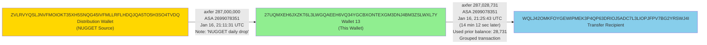

```mermaid
flowchart LR
    
    DIST["ZVLRVYQSLJNVFMOIOKT35XH5SNQG45IVFMLLRFLHDQJQA5TO5H3SO4TVDQ<br/>Distribution Wallet<br/>(NUGGET Source)"]
    
    WALLET["27UQMXEH6JXZKT6L3LWGQAEEH6VQ34YGCBXONTEXGM3DNJ4BM3ZSLWXL7Y<br/>Wallet 13<br/>(This Wallet)"]
    
    RECIPIENT["WQLJ42OMKFOYGEWIPMEK3P4QP63DRIOJ5ADC7L3LIOPJFPV7BG2YRSWJ4I<br/>Transfer Recipient"]
    
    DIST -->|"axfer 287,000,000<br/>ASA 2699078351<br/>Jan 16, 21:11:31 UTC<br/>Note: 'NUGGET daily drop'"| WALLET
    
    WALLET -->|"axfer 287,028,731<br/>ASA 2699078351<br/>Jan 16, 21:25:43 UTC<br/>(14 min 12 sec later)<br/>Used prior balance: 28,731<br/>Grouped transaction"| RECIPIENT
    
    style DIST fill:#ffd700
    style WALLET fill:#90EE90
    style RECIPIENT fill:#87CEEB
```
