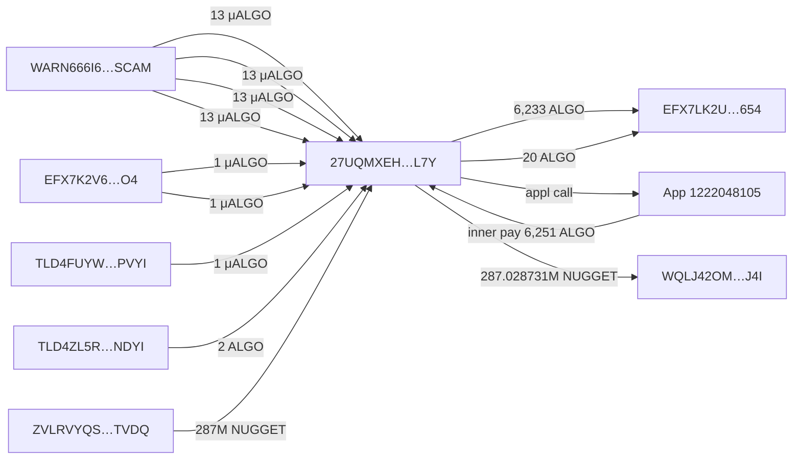

```mermaid
flowchart LR

WARN["WARN666I6…SCAM"]
EFX7["EFX7K2V6…O4"]
TLD4["TLD4FUYW…PVYI"]
TLD4Z["TLD4ZL5R…NDYI"]
ZVLR["ZVLRVYQS…TVDQ"]

HUB["27UQMXEH…L7Y"]
EFX7LK["EFX7LK2U…654"]
WQLJ["WQLJ42OM…J4I"]
APP["App 1222048105"]

WARN -- "13 μALGO" --> HUB
WARN -- "13 μALGO" --> HUB
WARN -- "13 μALGO" --> HUB
WARN -- "13 μALGO" --> HUB

EFX7 -- "1 μALGO" --> HUB
EFX7 -- "1 μALGO" --> HUB
TLD4 -- "1 μALGO" --> HUB
TLD4Z -- "2 ALGO" --> HUB

HUB -- "6,233 ALGO" --> EFX7LK
HUB -- "20 ALGO" --> EFX7LK

HUB -- "appl call" --> APP
APP -- "inner pay 6,251 ALGO" --> HUB

ZVLR -- "287M NUGGET" --> HUB
HUB -- "287.028731M NUGGET" --> WQLJ
```

