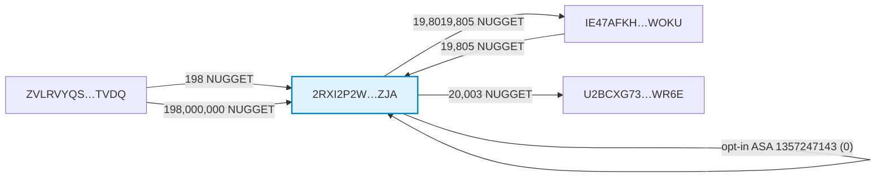

```mermaid
flowchart LR

%% =========================
%% Wallets
%% =========================
W_MAIN["2RXI2P2W…ZJA"]
ZVLR["ZVLRVYQS…TVDQ"]
IE47["IE47AFKH…WOKU"]
U2BC["U2BCXG73…WR6E"]

%% =========================
%% Asset opt-in (self-transfer)
%% =========================
W_MAIN -- "opt-in ASA 1357247143 (0)" --> W_MAIN

%% =========================
%% NUGGET inflows to main wallet
%% =========================
ZVLR -- "198 NUGGET" --> W_MAIN
ZVLR -- "198,000,000 NUGGET" --> W_MAIN
IE47 -- "19,805 NUGGET" --> W_MAIN

%% =========================
%% NUGGET outflows from main wallet
%% =========================
W_MAIN -- "19,8019,805 NUGGET" --> IE47
W_MAIN -- "20,003 NUGGET" --> U2BC

%% =========================
%% Styling
%% =========================
classDef hub fill:#e0f2fe,stroke:#0284c7,stroke-width:2px;
class W_MAIN hub;
```
