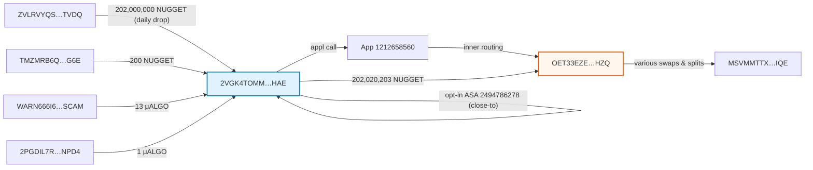

```mermaid
flowchart LR

%% =========================
%% Core wallets
%% =========================
W_MAIN["2VGK4TOMM…HAE"]
ZVLR["ZVLRVYQS…TVDQ"]
WARN["WARN666I6…SCAM"]
TMZ["TMZMRB6Q…G6E"]
SRC2["2PGDIL7R…NPD4"]

OET["OET33EZE…HZQ"]
MSVM["MSVMMTTX…IQE"]

APP["App 1212658560"]

%% =========================
%% Asset opt-ins (self)
%% =========================
W_MAIN -- "opt-in ASA 1357247143" --> W_MAIN
W_MAIN -- "opt-in ASA 2660433606 (close-to)" --> W_MAIN
W_MAIN -- "opt-in ASA 2494786278 (close-to)" --> W_MAIN

%% =========================
%% NUGGET inflows
%% =========================
ZVLR -- "202,000,000 NUGGET (daily drop)" --> W_MAIN
TMZ -- "200 NUGGET" --> W_MAIN

%% =========================
%% Spam / dust ALGO
%% =========================
WARN -- "13 μALGO" --> W_MAIN
SRC2 -- "1 μALGO" --> W_MAIN

%% =========================
%% App interaction & routing
%% =========================
W_MAIN -- "appl call" --> APP
APP -- "inner routing" --> OET

%% =========================
%% Major NUGGET movements
%% =========================
W_MAIN -- "202,020,203 NUGGET" --> OET
OET -- "various swaps & splits" --> MSVM

%% =========================
%% Styling
%% =========================
classDef hub fill:#e0f2fe,stroke:#0284c7,stroke-width:2px;
classDef router fill:#fff7ed,stroke:#ea580c,stroke-width:2px;

class W_MAIN hub;
class OET router;
```
