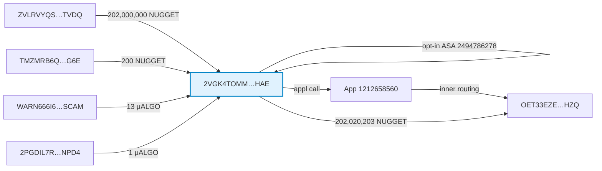

```mermaid
flowchart LR

SELF["2VGK4TOMM…HAE"]
ZVLR["ZVLRVYQS…TVDQ"]
WARN["WARN666I6…SCAM"]
TMZ["TMZMRB6Q…G6E"]
SRC2["2PGDIL7R…NPD4"]
OET["OET33EZE…HZQ"]
APP["App 1212658560"]

%% Opt-ins
SELF -- "opt-in ASA 1357247143" --> SELF
SELF -- "opt-in ASA 2660433606" --> SELF
SELF -- "opt-in ASA 2494786278" --> SELF

%% Inflows
ZVLR -- "202,000,000 NUGGET" --> SELF
TMZ -- "200 NUGGET" --> SELF
WARN -- "13 μALGO" --> SELF
SRC2 -- "1 μALGO" --> SELF

%% App usage
SELF -- "appl call" --> APP
APP -- "inner routing" --> OET

%% Outflow
SELF -- "202,020,203 NUGGET" --> OET

classDef hub fill:#e0f2fe,stroke:#0284c7,stroke-width:2px;
class SELF hub;
```
