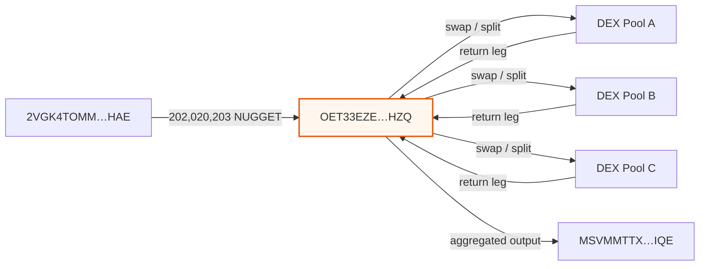

```mermaid
flowchart LR

W_MAIN["2VGK4TOMM…HAE"]
OET["OET33EZE…HZQ"]
MSVM["MSVMMTTX…IQE"]
POOL1["DEX Pool A"]
POOL2["DEX Pool B"]
POOL3["DEX Pool C"]

%% Inbound
W_MAIN -- "202,020,203 NUGGET" --> OET

%% Execution logic
OET -- "swap / split" --> POOL1
POOL1 -- "return leg" --> OET

OET -- "swap / split" --> POOL2
POOL2 -- "return leg" --> OET

OET -- "swap / split" --> POOL3
POOL3 -- "return leg" --> OET

%% Outbound
OET -- "aggregated output" --> MSVM

classDef router fill:#fff7ed,stroke:#ea580c,stroke-width:2px;
class OET router;
```
