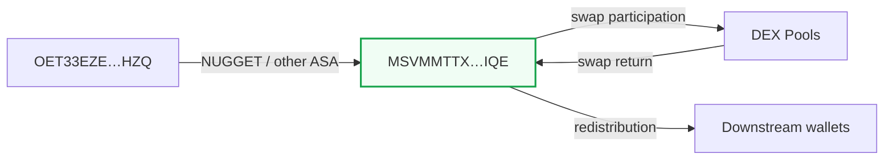

```mermaid
flowchart LR

OET["OET33EZE…HZQ"]
MSVM["MSVMMTTX…IQE"]
POOLX["DEX Pools"]
SINK["Downstream wallets"]

%% Inflows
OET -- "NUGGET / other ASA" --> MSVM

%% Activity
MSVM -- "swap participation" --> POOLX
POOLX -- "swap return" --> MSVM

%% Outflows
MSVM -- "redistribution" --> SINK

classDef sink fill:#f0fdf4,stroke:#16a34a,stroke-width:2px;
class MSVM sink;
```
