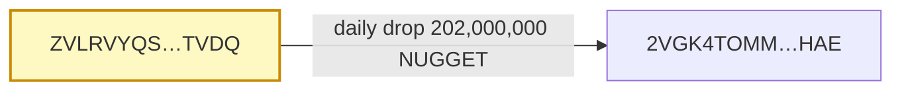

```mermaid
flowchart LR

ZVLR["ZVLRVYQS…TVDQ"]
RECIP["2VGK4TOMM…HAE"]

ZVLR -- "daily drop 202,000,000 NUGGET" --> RECIP

classDef source fill:#fef9c3,stroke:#ca8a04,stroke-width:2px;
class ZVLR source;
```
