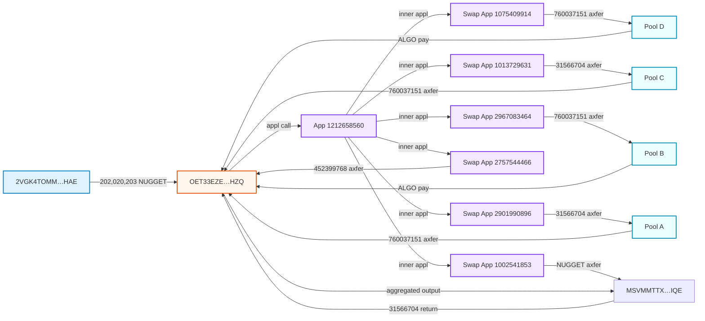

```mermaid
flowchart LR

%% ==================================================
%% Core wallets
%% ==================================================
W_MAIN["2VGK4TOMM…HAE"]
OET["OET33EZE…HZQ"]
MSVM["MSVMMTTX…IQE"]

%% ==================================================
%% App + execution layers
%% ==================================================
APP_MAIN["App 1212658560"]
SWAP1["Swap App 1002541853"]
SWAP2["Swap App 2901990896"]
SWAP3["Swap App 2967083464"]
SWAP4["Swap App 1013729631"]
SWAP5["Swap App 1075409914"]
SWAP6["Swap App 2757544466"]

%% ==================================================
%% Pools / transient holders
%% ==================================================
POOL_A["Pool A"]
POOL_B["Pool B"]
POOL_C["Pool C"]
POOL_D["Pool D"]

%% ==================================================
%% Entry
%% ==================================================
W_MAIN -- "202,020,203 NUGGET" --> OET
OET -- "appl call" --> APP_MAIN

%% ==================================================
%% Inner execution chain
%% ==================================================
APP_MAIN -- "inner appl" --> SWAP1
SWAP1 -- "NUGGET axfer" --> MSVM
MSVM -- "31566704 return" --> OET

APP_MAIN -- "inner appl" --> SWAP2
SWAP2 -- "31566704 axfer" --> POOL_A
POOL_A -- "760037151 axfer" --> OET

APP_MAIN -- "inner appl" --> SWAP3
SWAP3 -- "760037151 axfer" --> POOL_B
POOL_B -- "ALGO pay" --> OET

APP_MAIN -- "inner appl" --> SWAP4
SWAP4 -- "31566704 axfer" --> POOL_C
POOL_C -- "760037151 axfer" --> OET

APP_MAIN -- "inner appl" --> SWAP5
SWAP5 -- "760037151 axfer" --> POOL_D
POOL_D -- "ALGO pay" --> OET

APP_MAIN -- "inner appl" --> SWAP6
SWAP6 -- "452399768 axfer" --> OET

%% ==================================================
%% Exit
%% ==================================================
OET -- "aggregated output" --> MSVM

%% ==================================================
%% Styling
%% ==================================================
classDef hub fill:#e0f2fe,stroke:#0284c7,stroke-width:2px;
classDef router fill:#fff7ed,stroke:#ea580c,stroke-width:2px;
classDef app fill:#f3e8ff,stroke:#7c3aed,stroke-width:2px;
classDef pool fill:#ecfeff,stroke:#0891b2,stroke-width:2px;

class W_MAIN hub;
class OET router;
class APP_MAIN app;
class SWAP1,SWAP2,SWAP3,SWAP4,SWAP5,SWAP6 app;
class POOL_A,POOL_B,POOL_C,POOL_D pool;
```
