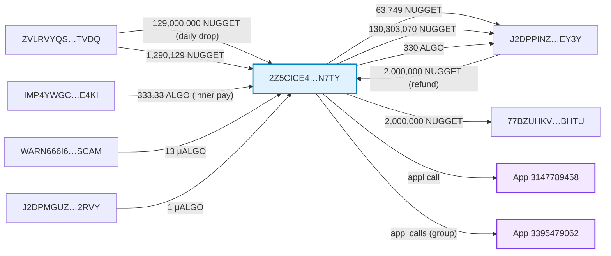

```mermaid
flowchart LR

%% =========================
%% Wallets
%% =========================
HUB["2Z5CICE4…N7TY"]
J2DP["J2DPPINZ…EY3Y"]
ZVLR["ZVLRVYQS…TVDQ"]
W77["77BZUHKV…BHTU"]
WARN["WARN666I6…SCAM"]
DUST["J2DPMGUZ…2RVY"]

APP1["App 3147789458"]
APP2["App 3395479062"]
IMP4["IMP4YWGC…E4KI"]

%% =========================
%% NUGGET inflows to HUB
%% =========================
ZVLR -- "129,000,000 NUGGET (daily drop)" --> HUB
ZVLR -- "1,290,129 NUGGET" --> HUB
J2DP -- "2,000,000 NUGGET (refund)" --> HUB

%% =========================
%% NUGGET outflows from HUB
%% =========================
HUB -- "63,749 NUGGET" --> J2DP
HUB -- "2,000,000 NUGGET" --> W77
HUB -- "130,303,070 NUGGET" --> J2DP

%% =========================
%% ALGO movements
%% =========================
HUB -- "330 ALGO" --> J2DP
IMP4 -- "333.33 ALGO (inner pay)" --> HUB

%% =========================
%% Spam / dust ALGO
%% =========================
WARN -- "13 μALGO" --> HUB
DUST -- "1 μALGO" --> HUB

%% =========================
%% Application activity
%% =========================
HUB -- "appl call" --> APP1
HUB -- "appl calls (group)" --> APP2

%% =========================
%% Styling
%% =========================
classDef hub fill:#e0f2fe,stroke:#0284c7,stroke-width:2px;
classDef app fill:#f3e8ff,stroke:#7c3aed,stroke-width:2px;
class HUB hub;
class APP1,APP2 app;
```
