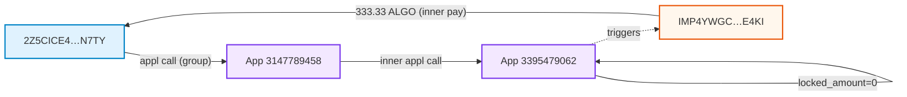

```mermaid
flowchart LR

%% ==================================================
%% Wallets
%% ==================================================
HUB["2Z5CICE4…N7TY"]
IMP4["IMP4YWGC…E4KI"]

%% ==================================================
%% Applications
%% ==================================================
APP_A["App 3147789458"]
APP_B["App 3395479062"]

%% ==================================================
%% Primary call
%% ==================================================
HUB -- "appl call (group)" --> APP_A

%% ==================================================
%% Inner app call (A → B)
%% ==================================================
APP_A -- "inner appl call" --> APP_B

%% ==================================================
%% App B finalization logic
%% ==================================================
APP_B -- "state: finalized=1" --> APP_B
APP_B -- "locked_amount=0" --> APP_B

%% ==================================================
%% Inner payment (2nd-level inner txn)
%% ==================================================
IMP4 -- "333.33 ALGO (inner pay)" --> HUB

%% ==================================================
%% Causal linkage (logical, not value transfer)
%% ==================================================
APP_B -. "triggers" .-> IMP4

%% ==================================================
%% Styling
%% ==================================================
classDef hub fill:#e0f2fe,stroke:#0284c7,stroke-width:2px;
classDef app fill:#f3e8ff,stroke:#7c3aed,stroke-width:2px;
classDef inner fill:#fff7ed,stroke:#ea580c,stroke-width:2px;

class HUB hub;
class APP_A,APP_B app;
class IMP4 inner;
```
