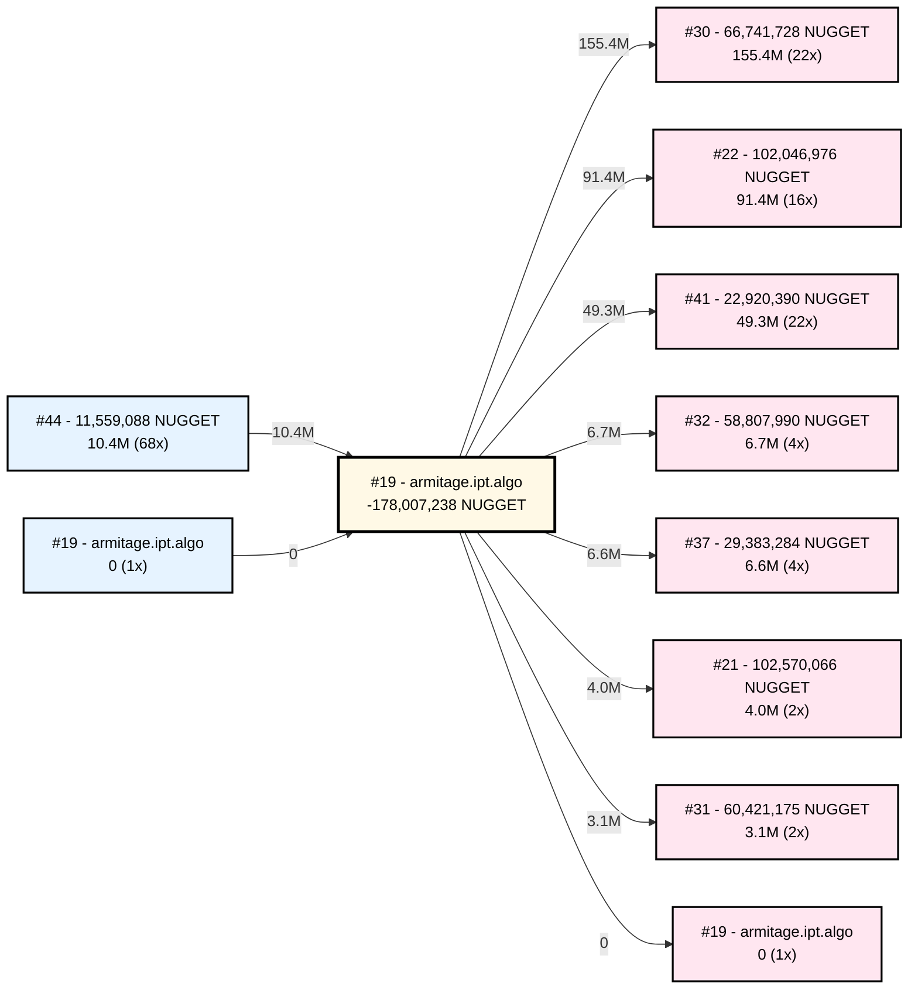

```mermaid
graph LR
    Center["#19 - armitage.ipt.algo<br/>-178,007,238 NUGGET"]
    style Center fill:#fff9e6,stroke:#000,stroke-width:3px,color:#000

    S1["#44 - 11,559,088 NUGGET<br/>10.4M (68x)"]
    S1 -->|10.4M| Center
    S2["#19 - armitage.ipt.algo<br/>0 (1x)"]
    S2 -->|0| Center

    R1["#30 - 66,741,728 NUGGET<br/>155.4M (22x)"]
    Center -->|155.4M| R1
    R2["#22 - 102,046,976 NUGGET<br/>91.4M (16x)"]
    Center -->|91.4M| R2
    R3["#41 - 22,920,390 NUGGET<br/>49.3M (22x)"]
    Center -->|49.3M| R3
    R4["#32 - 58,807,990 NUGGET<br/>6.7M (4x)"]
    Center -->|6.7M| R4
    R5["#37 - 29,383,284 NUGGET<br/>6.6M (4x)"]
    Center -->|6.6M| R5
    R6["#21 - 102,570,066 NUGGET<br/>4.0M (2x)"]
    Center -->|4.0M| R6
    R7["#31 - 60,421,175 NUGGET<br/>3.1M (2x)"]
    Center -->|3.1M| R7
    R8["#19 - armitage.ipt.algo<br/>0 (1x)"]
    Center -->|0| R8

    classDef sender fill:#e6f3ff,stroke:#000,stroke-width:2px,color:#000
    classDef receiver fill:#ffe6f0,stroke:#000,stroke-width:2px,color:#000
    class S1,S2 sender
    class R1,R2,R3,R4,R5,R6,R7,R8 receiver
```