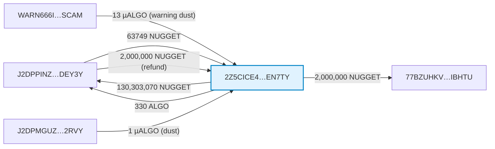

```mermaid
flowchart LR

%% =========================
%% Wallets
%% =========================
J2DP["J2DPPINZ…DEY3Y"]
Z5CI["2Z5CICE4…EN7TY"]
W77B["77BZUHKV…IBHTU"]
WARN["WARN666I…SCAM"]
J2DM["J2DPMGUZ…2RVY"]

%% =========================
%% ASA transfers (NUGGET – 2699078351)
%% =========================
J2DP -- "63749 NUGGET" --> Z5CI
J2DP -- "2,000,000 NUGGET (refund)" --> Z5CI
Z5CI -- "2,000,000 NUGGET" --> W77B
Z5CI -- "130,303,070 NUGGET" --> J2DP

%% =========================
%% ALGO payments
%% =========================
WARN -- "13 µALGO (warning dust)" --> Z5CI
J2DM -- "1 µALGO (dust)" --> Z5CI
Z5CI -- "330 ALGO" --> J2DP

%% =========================
%% Styling
%% =========================
classDef hub fill:#e0f2fe,stroke:#0284c7,stroke-width:2px;
class Z5CI hub;
```
