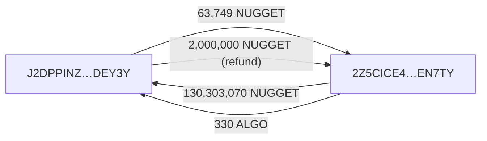

```mermaid
flowchart LR

J2DP["J2DPPINZ…DEY3Y"]
Z5CI["2Z5CICE4…EN7TY"]

J2DP -- "63,749 NUGGET" --> Z5CI
J2DP -- "2,000,000 NUGGET (refund)" --> Z5CI
Z5CI -- "130,303,070 NUGGET" --> J2DP
Z5CI -- "330 ALGO" --> J2DP
```
