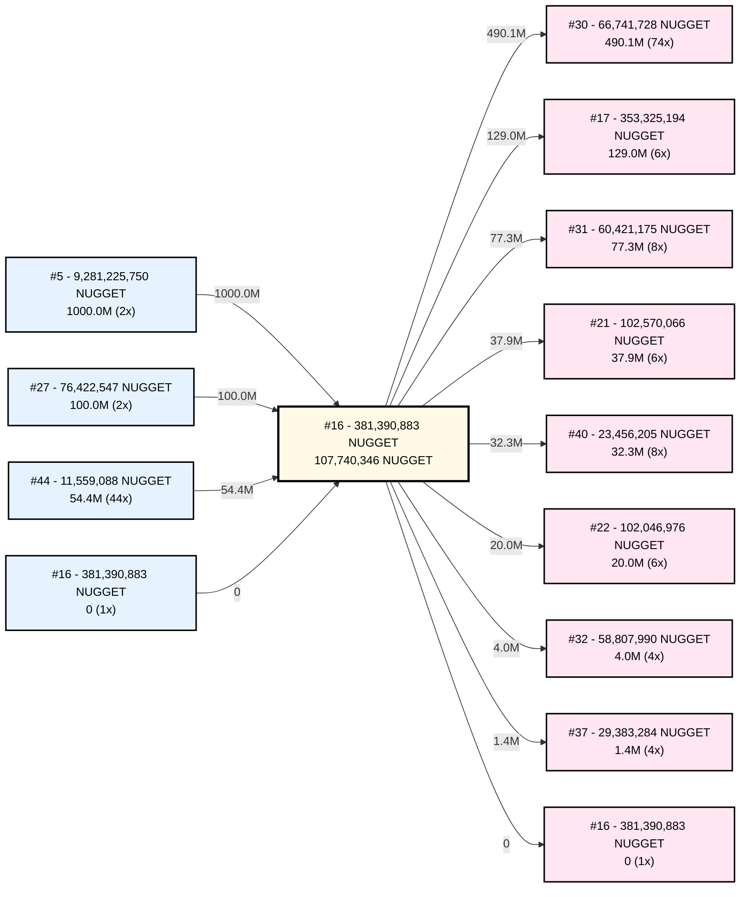

```mermaid
graph LR
    Center["#16 - 381,390,883 NUGGET<br/>107,740,346 NUGGET"]
    style Center fill:#fff9e6,stroke:#000,stroke-width:3px,color:#000

    S1["#5 - 9,281,225,750 NUGGET<br/>1000.0M (2x)"]
    S1 -->|1000.0M| Center
    S2["#27 - 76,422,547 NUGGET<br/>100.0M (2x)"]
    S2 -->|100.0M| Center
    S3["#44 - 11,559,088 NUGGET<br/>54.4M (44x)"]
    S3 -->|54.4M| Center
    S4["#16 - 381,390,883 NUGGET<br/>0 (1x)"]
    S4 -->|0| Center

    R1["#30 - 66,741,728 NUGGET<br/>490.1M (74x)"]
    Center -->|490.1M| R1
    R2["#17 - 353,325,194 NUGGET<br/>129.0M (6x)"]
    Center -->|129.0M| R2
    R3["#31 - 60,421,175 NUGGET<br/>77.3M (8x)"]
    Center -->|77.3M| R3
    R4["#21 - 102,570,066 NUGGET<br/>37.9M (6x)"]
    Center -->|37.9M| R4
    R5["#40 - 23,456,205 NUGGET<br/>32.3M (8x)"]
    Center -->|32.3M| R5
    R6["#22 - 102,046,976 NUGGET<br/>20.0M (6x)"]
    Center -->|20.0M| R6
    R7["#32 - 58,807,990 NUGGET<br/>4.0M (4x)"]
    Center -->|4.0M| R7
    R8["#37 - 29,383,284 NUGGET<br/>1.4M (4x)"]
    Center -->|1.4M| R8
    R9["#16 - 381,390,883 NUGGET<br/>0 (1x)"]
    Center -->|0| R9

    classDef sender fill:#e6f3ff,stroke:#000,stroke-width:2px,color:#000
    classDef receiver fill:#ffe6f0,stroke:#000,stroke-width:2px,color:#000

    class S1,S2,S3,S4 sender
    class R1,R2,R3,R4,R5,R6,R7,R8,R9 receiver
```