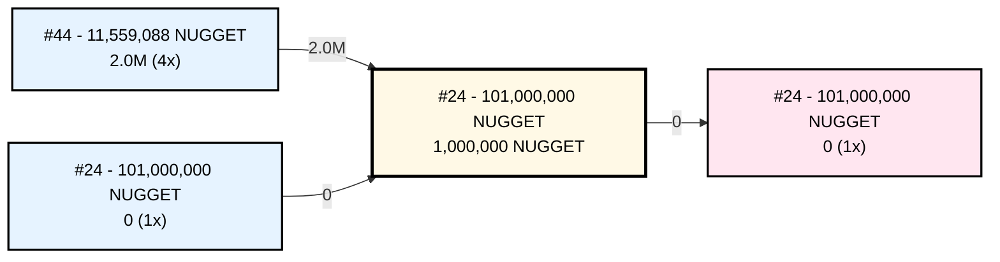

```mermaid
graph LR
    Center["#24 - 101,000,000 NUGGET<br/>1,000,000 NUGGET"]
    style Center fill:#fff9e6,stroke:#000,stroke-width:3px,color:#000

    S1["#44 - 11,559,088 NUGGET<br/>2.0M (4x)"]
    S1 -->|2.0M| Center
    S2["#24 - 101,000,000 NUGGET<br/>0 (1x)"]
    S2 -->|0| Center

    R1["#24 - 101,000,000 NUGGET<br/>0 (1x)"]
    Center -->|0| R1

    classDef sender fill:#e6f3ff,stroke:#000,stroke-width:2px,color:#000
    classDef receiver fill:#ffe6f0,stroke:#000,stroke-width:2px,color:#000
    class S1,S2 sender
    class R1 receiver
```