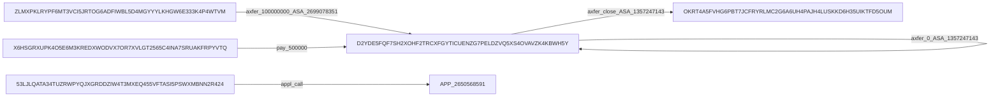

```mermaid
flowchart LR

%% =========================
%% Wallet nodes
%% =========================
D2Y[D2YDE5FQF7SH2XOHF2TRCXFGYTICUENZG7PELDZVQ5XS4OVAVZK4KBWH5Y]
W53[53LJLQATA34TUZRWPYQJXGRDDZIW4T3MXEQ455VFTASI5PSWXMBNN2R424]
ZLMX[ZLMXPKLRYPF6MT3VCI5JRTOG6ADFIWBL5D4MGYYYLKHGW6E333K4P4WTVM]
X6HS[X6HSGRXUPK4O5E6M3KREDXWODVX7OR7XVLGT2565C4INA7SRUAKFRPYVTQ]
OKRT[OKRT4A5FVHG6PBT7JCFRYRLMC2G6A6UH4PAJH4LUSKKD6H35UIKTFD5OUM]

%% =========================
%% App node
%% =========================
APP2650[APP_2650568591]

%% =========================
%% Outer application call
%% =========================
W53 -->|appl_call| APP2650

%% =========================
%% Inner transaction
%% =========================
ZLMX -->|axfer_100000000_ASA_2699078351| D2Y

%% =========================
%% Direct transactions
%% =========================
X6HS -->|pay_500000| D2Y
D2Y -->|axfer_0_ASA_2699078351| D2Y
D2Y -->|axfer_0_ASA_1357247143| D2Y
D2Y -->|axfer_close_ASA_1357247143| OKRT
```

