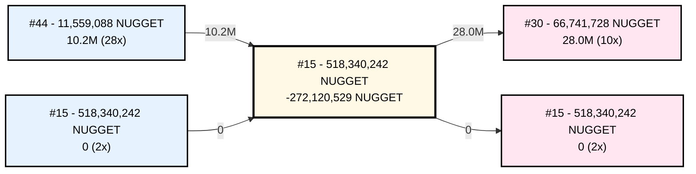

```mermaid
graph LR
    Center["#15 - 518,340,242 NUGGET<br/>-272,120,529 NUGGET"]
    style Center fill:#fff9e6,stroke:#000,stroke-width:3px,color:#000

    S1["#44 - 11,559,088 NUGGET<br/>10.2M (28x)"]
    S1 -->|10.2M| Center
    S2["#15 - 518,340,242 NUGGET<br/>0 (2x)"]
    S2 -->|0| Center

    R1["#30 - 66,741,728 NUGGET<br/>28.0M (10x)"]
    Center -->|28.0M| R1
    R2["#15 - 518,340,242 NUGGET<br/>0 (2x)"]
    Center -->|0| R2

    classDef sender fill:#e6f3ff,stroke:#000,stroke-width:2px,color:#000
    classDef receiver fill:#ffe6f0,stroke:#000,stroke-width:2px,color:#000

    class S1,S2 sender
    class R1,R2 receiver
```