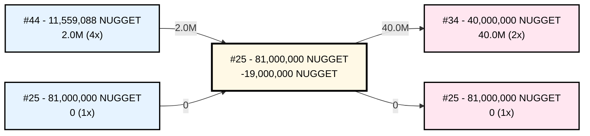

```mermaid
graph LR
    Center["#25 - 81,000,000 NUGGET<br/>-19,000,000 NUGGET"]
    style Center fill:#fff9e6,stroke:#000,stroke-width:3px,color:#000

    S1["#44 - 11,559,088 NUGGET<br/>2.0M (4x)"]
    S1 -->|2.0M| Center
    S2["#25 - 81,000,000 NUGGET<br/>0 (1x)"]
    S2 -->|0| Center

    R1["#34 - 40,000,000 NUGGET<br/>40.0M (2x)"]
    Center -->|40.0M| R1
    R2["#25 - 81,000,000 NUGGET<br/>0 (1x)"]
    Center -->|0| R2

    classDef sender fill:#e6f3ff,stroke:#000,stroke-width:2px,color:#000
    classDef receiver fill:#ffe6f0,stroke:#000,stroke-width:2px,color:#000
    class S1,S2 sender
    class R1,R2 receiver
```