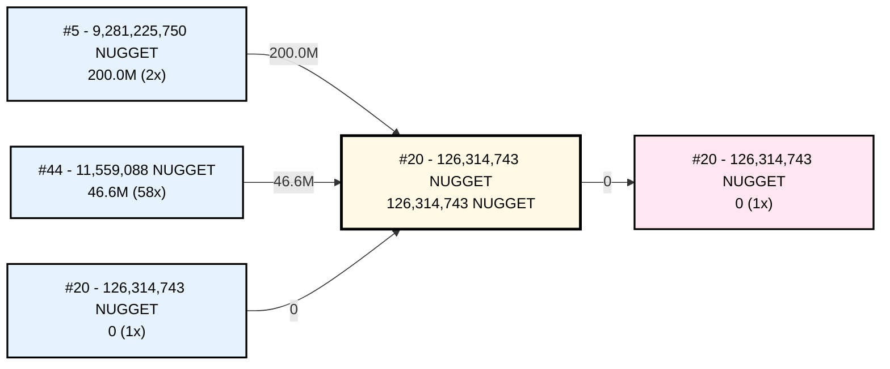

```mermaid
graph LR
    Center["#20 - 126,314,743 NUGGET<br/>126,314,743 NUGGET"]
    style Center fill:#fff9e6,stroke:#000,stroke-width:3px,color:#000

    S1["#5 - 9,281,225,750 NUGGET<br/>200.0M (2x)"]
    S1 -->|200.0M| Center
    S2["#44 - 11,559,088 NUGGET<br/>46.6M (58x)"]
    S2 -->|46.6M| Center
    S3["#20 - 126,314,743 NUGGET<br/>0 (1x)"]
    S3 -->|0| Center

    R1["#20 - 126,314,743 NUGGET<br/>0 (1x)"]
    Center -->|0| R1

    classDef sender fill:#e6f3ff,stroke:#000,stroke-width:2px,color:#000
    classDef receiver fill:#ffe6f0,stroke:#000,stroke-width:2px,color:#000
    class S1,S2,S3 sender
    class R1 receiver
```