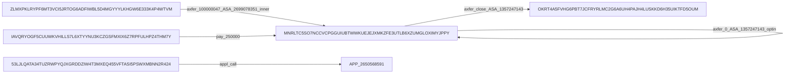

```mermaid
flowchart LR

%% =========================
%% Wallet nodes
%% =========================
MNRL[MNRLTC5SO7NCCVCPGGUIUBTWWKUEJEJXMKZFE3UTLB6XZUMGLOXIMYJPPY]
ZLMX[ZLMXPKLRYPF6MT3VCI5JRTOG6ADFIWBL5D4MGYYYLKHGW6E333K4P4WTVM]
W53[53LJLQATA34TUZRWPYQJXGRDDZIW4T3MXEQ455VFTASI5PSWXMBNN2R424]
IAVQ[IAVQRYOGF5CUUWKVHILLS7L6XTYYNU3KCZGSFMXIX6Z7RPFULHPZ4THM7Y]
OKRT[OKRT4A5FVHG6PBT7JCFRYRLMC2G6A6UH4PAJH4LUSKKD6H35UIKTFD5OUM]

%% =========================
%% App node
%% =========================
APP2650[APP_2650568591]

%% =========================
%% Application call and inner NUGGET transfer
%% =========================
W53 -->|appl_call| APP2650
ZLMX -->|axfer_100000047_ASA_2699078351_inner| MNRL

%% =========================
%% ASA NUGGET opt-in
%% =========================
MNRL -->|axfer_0_ASA_2699078351_optin| MNRL

%% =========================
%% ASA 1357247143 lifecycle
%% =========================
MNRL -->|axfer_0_ASA_1357247143_optin| MNRL
MNRL -->|axfer_close_ASA_1357247143| OKRT

%% =========================
%% ALGO payment
%% =========================
IAVQ -->|pay_250000| MNRL
```
