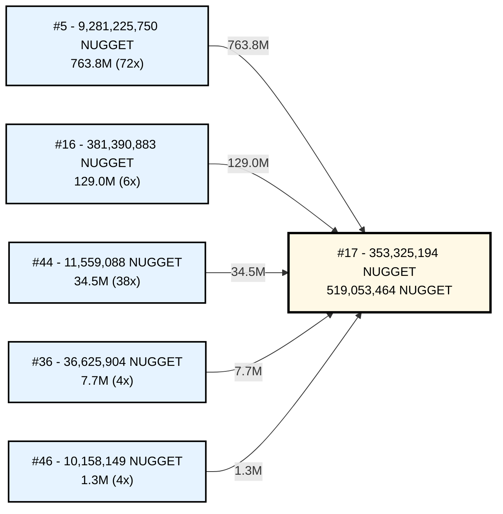

==================================================================================================================================
Rank   Address                                                      NFD                  Balance              % Supply  
==================================================================================================================================
1      Z6O6RXM32RT2WPGUJFDEWTCNDAYN3RQ2OAUVOVSGJVODAHDFT2YGD6NSYQ   -                    30,000,000,000       30.00%
2      RIZAW3CCPYF35UZNNFEKZKHGV7ZOKK3NB2V3UFHH6NQNQHHU2IBCR6IF6U   -                    20,000,000,000       20.00%
3      SONSPXETYAYYHR4RWOMCWMARSP6QXFIY2DEEUSIZWSLSQIUX3ZYVEEIIOE   -                    10,330,374,998       10.33%
4      KLIWCEHU7DZFKZCFAMVYZAUATSC34JMYNDLJSK7GG56PAQ4SGU4BOJ4D6E   -                    10,000,500,000       10.00%
5      DFTY23XTKDVPAVH3ELAHFUZQAIVEA2DMLBZNVHCYEANSTMVU4GUG5MZQCE   -                    9,281,225,750        9.28%
6      UNU5I5CMNUYSTMVKOPBZKOVO3SYNU64OLKAIF34HFC5IRYNG6WUH5BJ5DA   -                    4,002,500,000        4.00%
7      BNFIREKGRXEHCFOEQLTX3PU5SUCMRKDU7WHNBGZA4SXPW42OAHZBP7BPHY   -                    4,000,203,400        4.00%
8      BQ7BIUB6BVLYMMIOVZVR35YOYYRSR32AMJVP5LG67HNYI272SBMMCPBTJI   -                    2,925,000,000        2.93%
9      IYNQBIK7XOJQKNSO4RTS6JIS4GMHPMPU3URYBVRHANHQ5RYR4FOYNR4AQU   -                    1,010,000,000        1.01%
10     LAYM4DIYIVHGC3HVMPNL3DUL4OFTRDCRNFN64CVSWEI7SSXOTZ7XSLEH7A   -                    1,000,004,009        1.00%
11     ADBGL7NGCB2F726OPHJP4L7PRWC7IQPQBUCTMKA5PKVGBAAQU5YIANPDFY   -                    1,000,000,000        1.00%
12     OXL5BMUNEE2WOZT4RDJT2ING7QDRPFEKAPSSRTFEZXQ7Y6XG5S6VO5HE3I   -                    1,000,000,000        1.00%
13     5ZGVAJ3S3UEMLPN7BTXNJMH3QN2LESVYOSIE7WMUHREYM7BZTUXKBCLFVY   -                    1,000,000,000        1.00%
14     7R72H7QHC6WGG2RDQHVZQ5AYDTZNHTRHIL3Q3PLCHNZWL24LHWWAIIKAHY   -                    1,000,000,000        1.00%
15     EHJRNGYYUDVC2HO4IQ3F4SJYYCBUFV5FZY6C3F3LH6S5KLLCE6XRWL6Y2I   -                    518,340,242          0.52%
16     77BZUHKVFT5KO3SN2ARTF7B3E5CPGEVPP2F54U5WJ7MXZK33MJ45CIBHTU   -                    381,390,883          0.38%
17     MSVMMTTX4QLOWIOQLRREL3EF7D363XRHOM2VJGX5X7TS3Y3VLZUJEOEIQE   -                    353,325,194          0.35%
18     ZYKVUWW35TS6MAMJ24NDQYUYD65OFLK7FDPVWOU6RYWJU4L6A4IFEXMJKA   -                    335,353,557          0.34%
19     53LJLQATA34TUZRWPYQJXGRDDZIW4T3MXEQ455VFTASI5PSWXMBNN2R424   armitage.ipt.algo    200,447,194          0.20%
20     JQMLYEBFFXID3BUPZUEW6RIWDHYN2DAASN45RK4NLX4WKLAILO5GSQH4UY   -                    126,314,743          0.13%
21     DOKBPIJE664TTXWABDQSAB447LJBO2MMI5OT76247OAYZPCC4BPEZJYPJQ   -                    102,570,066          0.10%
22     VO4Z5WKFZR3LGTEKD32V7JMFAEOORMNYXKFVZU23X2LYH7JINUULK7MWMA   -                    102,046,976          0.10%
23     MNRLTC5SO7NCCVCPGGUIUBTWWKUEJEJXMKZFE3UTLB6XZUMGLOXIMYJPPY   -                    101,000,047          0.10%
24     D2YDE5FQF7SH2XOHF2TRCXFGYTICUENZG7PELDZVQ5XS4OVAVZK4KBWH5Y   -                    101,000,000          0.10%
25     IAVQRYOGF5CUUWKVHILLS7L6XTYYNU3KCZGSFMXIX6Z7RPFULHPZ4THM7Y   -                    81,000,000           0.08%
26     X6HSGRXUPK4O5E6M3KREDXWODVX7OR7XVLGT2565C4INA7SRUAKFRPYVTQ   -                    81,000,000           0.08%
27     ZXJPSWVZ2QZUULP2U3YXPA32ZH6FPLXX7FIQBUP3ETF25EMYTCEGO4H7NE   -                    76,422,547           0.08%
28     XB6ICYSQ6TFR77JJE6OR4KLE4M7M4ISGF6NU3ZL7IBITUPFGO5DX374ZBM   -                    73,040,267           0.07%
29     KT3E2E3YBYYY2NHALRPBWMP5DIDY6OVTR2SWTNCR7ZR3LPUQYDFPXB56BU   -                    69,052,302           0.07%
30     WQLJ42OMKFOYGEWIPMEK3P4QP63DRIOJ5ADC7L3LIOPJFPV7BG2YRSWJ4I   -                    66,741,728           0.07%
31     ETXVLIFI5JQWLT3RNQLLU2QH5CQFCUA4XDJQ5HAQKJLBIITYSPXFJDU2ZU   -                    60,421,175           0.06%
32     LLTBHDCRZBVAKWNVLQR4VC7BRMBELNKQLIO2ER5QBUELORKUZ2FLG7XYE4   -                    58,807,990           0.06%
33     REAICG5LS4GPV7BDWLENLQHSWZBMFLQPCXDNLJAMBVY73GXTS6BQJZOOCY   -                    55,000,000           0.06%
34     BWJYDS4TYCUKO2TE4MX5CLMOHOIBBCLOL6DL6JWRFIN6W2HZLZLIWHNNC4   -                    40,000,000           0.04%
35     U7URB63DJIDHOICD3NNHM2BJRF4NKTESHY3G56LTAHGDCAZBXA24FMJ3XI   -                    38,000,000           0.04%
36     HAJZGU26VM4KRUFY4WU7SZHC54I2RXZVQVBAPVOLE2R34TRRR56EWW2PTM   -                    36,625,904           0.04%
37     VOQGEEL37M7KD23QHGOYNLVNN3YDGRCXMYEOIGJGHQMHURML754HIXRVIE   -                    29,383,284           0.03%
38     ERFCVM4QBF5TXNONPVG62QTNYHWNYRTZDR7P6JFXYLM2VX6PNGJO6X5Z5E   -                    26,312,912           0.03%
39     TIGER4VK5MHK2TIE2DLV5LQSJLZQROKY4H5VC3HXNTMDOPPMSPKKS4TK44   -                    24,129,604           0.02%
40     5U2CCQKYSJKHUFIMRYPAM643IXGLZKGD36LRKJU6C7CWRJFH2SEWKIYU3I   -                    23,456,205           0.02%
41     AOZJGVKHIL5NQZM24P3ETFDDC7O536JS6NZ5KYOUYFJQIEGQKZ7SQDIZNY   -                    22,920,390           0.02%
42     YGZQWOGTIMXP4HQZYZSIQ5HXGZZVONAEIBYZ4ECQNKIH64ZGUJ2NIWNNKQ   -                    15,701,398           0.02%
43     G7U7HTBOAEQBQIDMPIQQZLYQ3IZ6DFIARVNA2MMBO4QLTXKECBH7BOQF4Y   -                    13,637,275           0.01%
44     ZVLRVYQSLJNVFMOIOKT35XH5SNQG45IVFMLLRFLHDQJQA5TO5H3SO4TVDQ   -                    11,559,088           0.01%
45     B2TWTYVQV5XZ7P7WV6RZAJ7HUAWFKAGXEUWKB6RWJGW3NC4JR44PST7PRA   -                    11,109,247           0.01%
46     VVRXWEFWAB2BV2ZSDPMQTWPKPUFSACEEAP5XXY23WEZYXGUOMRMCGCQBUY   -                    10,158,149           0.01%
47     DFTKGVC54EN2UTK7XDVKJVEF6CSSKUECRA324SOH6GJCWJI7JNDZY3KGWM   -                    9,862,164            0.01%
48     MWMAYRBLPI4RPM2DB6UCUVL3J2VLITQQ6BM2RT6V3QEMLCHO73SJBBHGHI   -                    7,933,434            0.01%
49     TBKH6I4TIKO6OV35BBFB74SGPUGGPZ7QINKPNLSVG24OR5IUKHDIXHFDGM   -                    7,666,765            0.01%
50     O24MQ76XT575T4DE4BI3ZE56QRDPRXSYNYPXVAUPXX52GTK4GJRHAZOBZA   -                    6,813,209            0.01%
==================================================================================================================================
