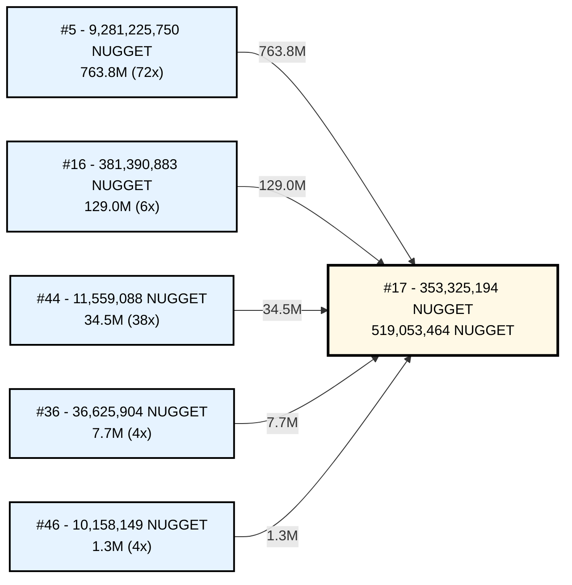

```mermaid
graph LR
    Center["#17 - 353,325,194 NUGGET<br/>519,053,464 NUGGET"]
    style Center fill:#fff9e6,stroke:#000,stroke-width:3px,color:#000

    S1["#5 - 9,281,225,750 NUGGET<br/>763.8M (72x)"]
    S1 -->|763.8M| Center
    S2["#16 - 381,390,883 NUGGET<br/>129.0M (6x)"]
    S2 -->|129.0M| Center
    S3["#44 - 11,559,088 NUGGET<br/>34.5M (38x)"]
    S3 -->|34.5M| Center
    S4["#36 - 36,625,904 NUGGET<br/>7.7M (4x)"]
    S4 -->|7.7M| Center
    S5["#46 - 10,158,149 NUGGET<br/>1.3M (4x)"]
    S5 -->|1.3M| Center


    classDef sender fill:#e6f3ff,stroke:#000,stroke-width:2px,color:#000
    classDef receiver fill:#ffe6f0,stroke:#000,stroke-width:2px,color:#000
    class S1,S2,S3,S4,S5 sender
```