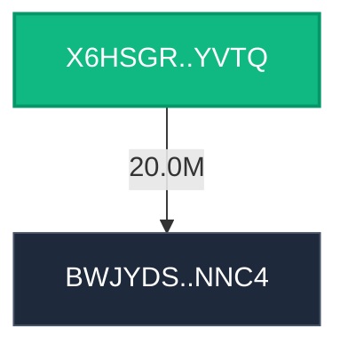

```mermaid
graph TD

    %% Nodes
    N0["X6HSGR..YVTQ"]
    N1["BWJYDS..NNC4"]

    %% Flows
    N0 -->|"20.0M"| N1

    %% Styling
    style N0 fill:#10b981,stroke:#059669,stroke-width:2px
    classDef default fill:#1e293b,stroke:#475569,stroke-width:1px,color:#fff
```

## Address Reference

- **N0**: `X6HSGRXUPK4O5E6M3KREDXWODVX7OR7XVLGT2565C4INA7SRUAKFRPYVTQ`
- **N1**: `BWJYDS4TYCUKO2TE4MX5CLMOHOIBBCLOL6DL6JWRFIN6W2HZLZLIWHNNC4`
