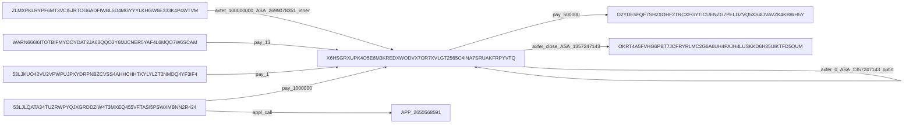

```mermaid
flowchart LR

%% =========================
%% Wallet nodes
%% =========================
X6HS[X6HSGRXUPK4O5E6M3KREDXWODVX7OR7XVLGT2565C4INA7SRUAKFRPYVTQ]
ZLMX[ZLMXPKLRYPF6MT3VCI5JRTOG6ADFIWBL5D4MGYYYLKHGW6E333K4P4WTVM]
W53[53LJLQATA34TUZRWPYQJXGRDDZIW4T3MXEQ455VFTASI5PSWXMBNN2R424]
WARN[WARN666I6ITOTBIFMYOOYDAT2JA63QQO2Y6MJCNER5YAF4L6MQO7W6SCAM]
W53B[53LJKUO42VU2VPWPUJPXYDRPNBZCVSS4AHHCHHTKYLYLZT2NMDQ4YF3IF4]
D2YD[D2YDE5FQF7SH2XOHF2TRCXFGYTICUENZG7PELDZVQ5XS4OVAVZK4KBWH5Y]
OKRT[OKRT4A5FVHG6PBT7JCFRYRLMC2G6A6UH4PAJH4LUSKKD6H35UIKTFD5OUM]

%% =========================
%% App node
%% =========================
APP2650[APP_2650568591]

%% =========================
%% Application call and inner NUGGET transfer
%% =========================
W53 -->|appl_call| APP2650
ZLMX -->|axfer_100000000_ASA_2699078351_inner| X6HS

%% =========================
%% ASA NUGGET opt-in
%% =========================
X6HS -->|axfer_0_ASA_2699078351_optin| X6HS

%% =========================
%% ASA 1357247143 lifecycle
%% =========================
X6HS -->|axfer_0_ASA_1357247143_optin| X6HS
X6HS -->|axfer_close_ASA_1357247143| OKRT

%% =========================
%% ALGO payments
%% =========================
WARN -->|pay_13| X6HS
W53B -->|pay_1| X6HS
W53 -->|pay_1000000| X6HS
X6HS -->|pay_500000| D2YD
```
