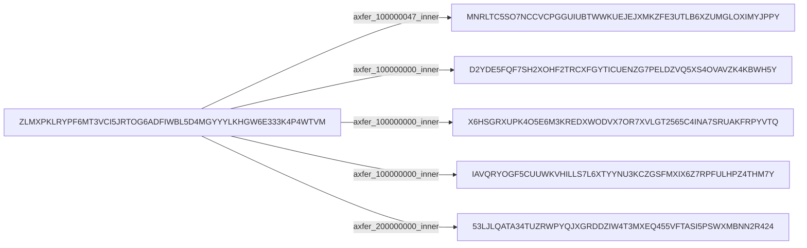

```mermaid
flowchart LR

ZLMX[ZLMXPKLRYPF6MT3VCI5JRTOG6ADFIWBL5D4MGYYYLKHGW6E333K4P4WTVM]
MNRL[MNRLTC5SO7NCCVCPGGUIUBTWWKUEJEJXMKZFE3UTLB6XZUMGLOXIMYJPPY]
D2YD[D2YDE5FQF7SH2XOHF2TRCXFGYTICUENZG7PELDZVQ5XS4OVAVZK4KBWH5Y]
X6HS[X6HSGRXUPK4O5E6M3KREDXWODVX7OR7XVLGT2565C4INA7SRUAKFRPYVTQ]
IAVQ[IAVQRYOGF5CUUWKVHILLS7L6XTYYNU3KCZGSFMXIX6Z7RPFULHPZ4THM7Y]
W53[53LJLQATA34TUZRWPYQJXGRDDZIW4T3MXEQ455VFTASI5PSWXMBNN2R424]

ZLMX -->|axfer_100000047_inner| MNRL
ZLMX -->|axfer_100000000_inner| D2YD
ZLMX -->|axfer_100000000_inner| X6HS
ZLMX -->|axfer_100000000_inner| IAVQ
ZLMX -->|axfer_200000000_inner| W53
```
