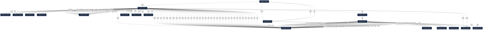

```mermaid
graph TD
    N0["ZOIPADTZ...ALK3DU"]
    N1["77BZUHKV...CIBHTU"]
    N2["5ZN2ASO6...I2UPYI"]
    N3["WQLJ42OM...RSWJ4I"]
    N4["MSVMMTTX...EOEIQE"]
    N5["VO4Z5WKF...K7MWMA"]
    N6["5U2CCQKY...KIYU3I"]
    N7["DOKBPIJE...ZJYPJQ"]
    N8["GHDRSAOX...RDAPGI"]
    N9["Y62D6MUS...RZNVIQ"]
    N10["ETXVLIFI...JDU2ZU"]
    N11["LLTBHDCR...G7XYE4"]
    N12["VOQGEEL3...IXRVIE"]
    N13["UXIHAZLH...5V2UN4"]
    N14["ESPO2SMA...ZG7D5A"]
    N15["AOZJGVKH...QDIZNY"]
    N16["F6XEIG5I...WGICBY"]
    N17["5GXCRDKY...OFS63U"]
    N18["KCO56VZH...XVLARY"]

    N0 -->|13.14M<br/>01/28| N1
    N0 -->|212.00M<br/>01/17| N2
    N1 -->|38.30M<br/>02/01| N3
    N1 -->|38.29M<br/>02/01| N3
    N1 -->|38.41M<br/>02/01| N3
    N1 -->|9.10M<br/>02/01| N3
    N1 -->|9.02M<br/>02/01| N3
    N1 -->|10.00M<br/>02/01| N3
    N1 -->|18.39M<br/>02/01| N3
    N1 -->|20.00M<br/>02/01| N3
    N1 -->|35.09M<br/>02/01| N4
    N1 -->|20.95M<br/>02/01| N3
    N1 -->|15.07M<br/>02/01| N4
    N1 -->|3.02M<br/>02/01| N3
    N1 -->|2.98M<br/>02/01| N3
    N1 -->|2.95M<br/>02/01| N3
    N1 -->|2.91M<br/>02/01| N3
    N1 -->|2.87M<br/>02/01| N3
    N1 -->|7.99M<br/>02/01| N5
    N1 -->|1.00M<br/>02/01| N3
    N1 -->|1.00M<br/>02/01| N3
    N1 -->|1.00M<br/>02/01| N3
    N1 -->|1.00M<br/>02/01| N3
    N1 -->|1.00M<br/>02/01| N3
    N1 -->|1.00M<br/>02/01| N3
    N1 -->|1.00M<br/>02/01| N3
    N1 -->|1.00M<br/>02/01| N3
    N1 -->|1.00M<br/>02/01| N3
    N1 -->|1.00M<br/>02/01| N3
    N1 -->|5.65M<br/>01/31| N6
    N1 -->|5.65M<br/>01/31| N6
    N1 -->|4.63M<br/>01/31| N6
    N1 -->|215.64K<br/>01/31| N6
    N1 -->|6.84M<br/>01/31| N7
    N1 -->|1.00M<br/>01/31| N5
    N1 -->|1.00M<br/>01/31| N8
    N1 -->|1.00M<br/>01/31| N8
    N1 -->|1.00M<br/>01/31| N5
    N1 -->|1.00M<br/>01/31| N8
    N1 -->|2.00M<br/>01/31| N9
    N1 -->|5.35M<br/>01/31| N7
    N1 -->|900.00K<br/>01/31| N8
    N1 -->|900.00K<br/>01/31| N8
    N1 -->|900.00K<br/>01/31| N8
    N1 -->|900.00K<br/>01/31| N8
    N1 -->|900.00K<br/>01/31| N8
    N1 -->|900.00K<br/>01/31| N8
    N1 -->|5.63M<br/>01/31| N10
    N1 -->|1.00M<br/>01/31| N10
    N1 -->|1.00M<br/>01/31| N8
    N1 -->|900.00K<br/>01/31| N8
    N1 -->|900.00K<br/>01/31| N8
    N1 -->|900.00K<br/>01/31| N8
    N1 -->|900.00K<br/>01/31| N8
    N1 -->|14.04M<br/>01/31| N10
    N1 -->|5.00M<br/>01/31| N8
    N1 -->|5.00M<br/>01/31| N8
    N1 -->|1.00M<br/>01/31| N8
    N1 -->|1.00M<br/>01/31| N8
    N1 -->|1.00M<br/>01/31| N8
    N1 -->|1.00M<br/>01/31| N8
    N1 -->|17.99M<br/>01/31| N10
    N1 -->|9.00M<br/>01/31| N8
    N1 -->|9.00M<br/>01/31| N8
    N1 -->|6.74M<br/>01/31| N7
    N1 -->|5.85M<br/>01/31| N3
    N1 -->|1.00M<br/>01/31| N3
    N1 -->|1.00M<br/>01/31| N3
    N1 -->|1.00M<br/>01/31| N3
    N1 -->|1.00M<br/>01/31| N3
    N1 -->|1.00M<br/>01/31| N3
    N1 -->|1.00M<br/>01/31| N3
    N1 -->|1.00M<br/>01/31| N3
    N1 -->|1.00M<br/>01/31| N3
    N1 -->|1.00M<br/>01/31| N3
    N1 -->|1.00M<br/>01/30| N3
    N1 -->|1.21M<br/>01/28| N11
    N1 -->|407.48K<br/>01/28| N12
    N1 -->|23.47M<br/>01/28| N13
    N1 -->|267.88K<br/>01/27| N12
    N1 -->|782.71K<br/>01/27| N11
    N1 -->|14.36M<br/>01/27| N4
    N1 -->|1.00M<br/>01/27| N3
    N1 -->|1.00M<br/>01/27| N3
    N1 -->|11.57M<br/>01/26| N13
    N1 -->|6.60M<br/>01/26| N13
    N2 -->|12.00M<br/>01/28| N0
    N2 -->|250<br/>01/28| N0
    N2 -->|2.58M<br/>01/26| N14
    N2 -->|3.36M<br/>01/19| N15
    N2 -->|12.23M<br/>01/17| N3
    N2 -->|212.00M<br/>01/17| N3
    N9 -->|2.11M<br/>01/31| N16
    N16 -->|1.00M<br/>02/01| N15
    N16 -->|564.81K<br/>02/01| N3
    N16 -->|3.15M<br/>02/01| N3
    N16 -->|18.90M<br/>02/01| N3
    N16 -->|25.20M<br/>02/01| N3
    N16 -->|2.26M<br/>02/01| N3
    N16 -->|4.01M<br/>02/01| N3
    N16 -->|20.02M<br/>02/01| N3
    N16 -->|15.18M<br/>02/01| N15
    N16 -->|7.14M<br/>02/01| N3
    N16 -->|47.87M<br/>02/01| N3
    N16 -->|1.00M<br/>02/01| N3
    N16 -->|22.99M<br/>02/01| N3
    N16 -->|23.99M<br/>02/01| N3
    N16 -->|2.50M<br/>01/28| N3
    N16 -->|2.50M<br/>01/28| N3
    N16 -->|5.00M<br/>01/28| N3
    N16 -->|2.50M<br/>01/28| N3
    N16 -->|2.50M<br/>01/28| N3
    N16 -->|2.50M<br/>01/28| N3
    N16 -->|2.50M<br/>01/28| N3
    N16 -->|2.50M<br/>01/28| N3
    N16 -->|2.50M<br/>01/28| N3
    N16 -->|2.50M<br/>01/28| N3
    N16 -->|2.50M<br/>01/28| N3
    N16 -->|2.50M<br/>01/28| N3
    N16 -->|2.50M<br/>01/28| N3
    N16 -->|2.50M<br/>01/28| N3
    N16 -->|3.37M<br/>01/28| N15
    N16 -->|1.00M<br/>01/28| N3
    N16 -->|1.00M<br/>01/27| N3
    N16 -->|2.50M<br/>01/27| N3
    N16 -->|2.50M<br/>01/27| N3
    N16 -->|76.28K<br/>01/26| N15
    N16 -->|1.00M<br/>01/26| N17
    N16 -->|1.00M<br/>01/26| N3
    N16 -->|5.00M<br/>01/26| N3
    N16 -->|5.00M<br/>01/26| N3
    N16 -->|1.70M<br/>01/25| N17
    N16 -->|1.80M<br/>01/25| N17
    N16 -->|2.00M<br/>01/25| N3
    N16 -->|3.80M<br/>01/25| N17
    N16 -->|110.65K<br/>01/24| N3
    N16 -->|2.00M<br/>01/24| N3
    N16 -->|447.54K<br/>01/24| N3
    N16 -->|2.76M<br/>01/23| N3
    N16 -->|15.00M<br/>01/23| N18
    N16 -->|700.00K<br/>01/23| N3
    N16 -->|667.84K<br/>01/23| N3
    N16 -->|2.33M<br/>01/22| N3
    N16 -->|4.03M<br/>01/22| N15
    N16 -->|8.50M<br/>01/22| N3
    N16 -->|2.64M<br/>01/22| N3
    N16 -->|2.00M<br/>01/22| N3
    N16 -->|2.15M<br/>01/22| N3
    N16 -->|2.00M<br/>01/22| N3
    N16 -->|7.72M<br/>01/22| N3
    N16 -->|4.19M<br/>01/21| N12
    N16 -->|2.15M<br/>01/19| N12
    N16 -->|22.40M<br/>01/17| N3
    N16 -->|15.03M<br/>01/17| N3
    N16 -->|27.03M<br/>01/17| N3
    N18 -->|1.00M<br/>01/24| N16
    N18 -->|14.00M<br/>01/23| N16

    classDef default fill:#1e293b,stroke:#3b82f6,stroke-width:2px,color:#fff
```
