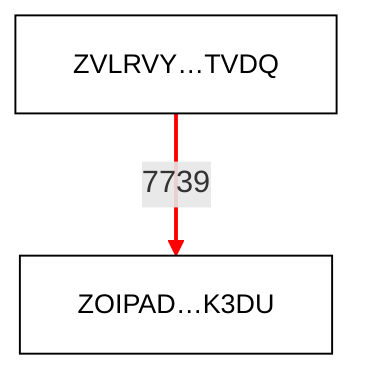

```mermaid
flowchart TD

A["ZVLRVY…TVDQ"]
B["ZOIPAD…K3DU"]
A -->|"7739"| B

classDef wallet fill:#ffffff,stroke:#000000,color:#000000,font-size:14px;
class A,B wallet;
linkStyle default stroke:#ff0000,stroke-width:2px;
```
