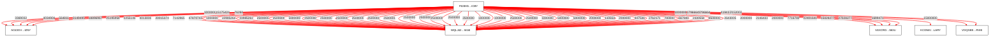

```mermaid
flowchart TD

N0["5GXCRD…S63U"]
N1["AOZJGV…IZNY"]
N2["F6XEIG…ICBY"]
N3["KCO56V…LARY"]
N4["VOQGEE…RVIE"]
N5["WQLJ42…WJ4I"]

N2 -->|"1000000"| N1
N2 -->|"564811"| N5
N2 -->|"3149495"| N5
N2 -->|"18896967"| N5
N2 -->|"25195956"| N5
N2 -->|"2255146"| N5
N2 -->|"4013000"| N5
N2 -->|"20015374"| N5
N2 -->|"15175424"| N1
N2 -->|"7142965"| N5
N2 -->|"47870742"| N5
N2 -->|"1000000"| N5
N2 -->|"22985264"| N5
N2 -->|"23985263"| N5
N2 -->|"2500000"| N5
N2 -->|"2500000"| N5
N2 -->|"5000000"| N5
N2 -->|"2500000"| N5
N2 -->|"2500000"| N5
N2 -->|"2500000"| N5
N2 -->|"2500000"| N5
N2 -->|"2500001"| N5
N2 -->|"2500001"| N5
N2 -->|"2500000"| N5
N2 -->|"2500000"| N5
N2 -->|"2500000"| N5
N2 -->|"2500000"| N5
N2 -->|"2500000"| N5
N2 -->|"3369032"| N1
N2 -->|"1000000"| N5
N2 -->|"1000000"| N5
N2 -->|"2500000"| N5
N2 -->|"2500000"| N5
N2 -->|"76284"| N1
N2 -->|"1000000"| N0
N2 -->|"1000000"| N5
N2 -->|"5000000"| N5
N2 -->|"5000000"| N5
N2 -->|"1699471"| N0
N2 -->|"1796664"| N0
N2 -->|"2000000"| N5
N2 -->|"3796664"| N0
N2 -->|"110653"| N5
N2 -->|"2000000"| N5
N2 -->|"447536"| N5
N2 -->|"2762171"| N5
N2 -->|"15000000"| N3
N2 -->|"700000"| N5
N2 -->|"667840"| N5
N2 -->|"2330558"| N5
N2 -->|"4034904"| N1
N2 -->|"8500000"| N5
N2 -->|"2643005"| N5
N2 -->|"2000000"| N5
N2 -->|"2146433"| N5
N2 -->|"2000000"| N5
N2 -->|"7716783"| N5
N2 -->|"4194373"| N4
N2 -->|"2152002"| N4
N2 -->|"22401641"| N5
N2 -->|"15028277"| N5
N2 -->|"27028277"| N5

classDef wallet fill:#ffffff,stroke:#000000,color:#000000,font-size:14px;
class N0,N1,N2,N3,N4,N5 wallet;
linkStyle default stroke:#ff0000,stroke-width:2px;
```
