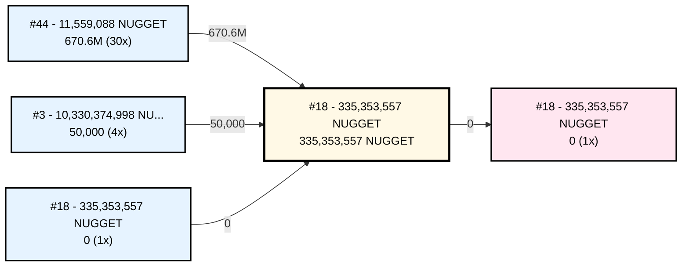

```mermaid
graph LR
    Center["#18 - 335,353,557 NUGGET<br/>335,353,557 NUGGET"]
    style Center fill:#fff9e6,stroke:#000,stroke-width:3px,color:#000

    S1["#44 - 11,559,088 NUGGET<br/>670.6M (30x)"]
    S1 -->|670.6M| Center
    S2["#3 - 10,330,374,998 NU...<br/>50,000 (4x)"]
    S2 -->|50,000| Center
    S3["#18 - 335,353,557 NUGGET<br/>0 (1x)"]
    S3 -->|0| Center

    R1["#18 - 335,353,557 NUGGET<br/>0 (1x)"]
    Center -->|0| R1

    classDef sender fill:#e6f3ff,stroke:#000,stroke-width:2px,color:#000
    classDef receiver fill:#ffe6f0,stroke:#000,stroke-width:2px,color:#000
    class S1,S2,S3 sender
    class R1 receiver
```