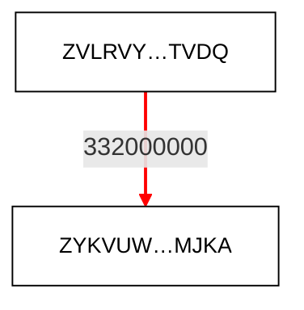

```mermaid
flowchart TD

N0["ZVLRVY…TVDQ"]
N1["ZYKVUW…MJKA"]

N0 -->|"332000000"| N1

classDef wallet fill:#ffffff,stroke:#000000,color:#000000,font-size:14px;
class N0,N1 wallet;
linkStyle default stroke:#ff0000,stroke-width:2px;
```
