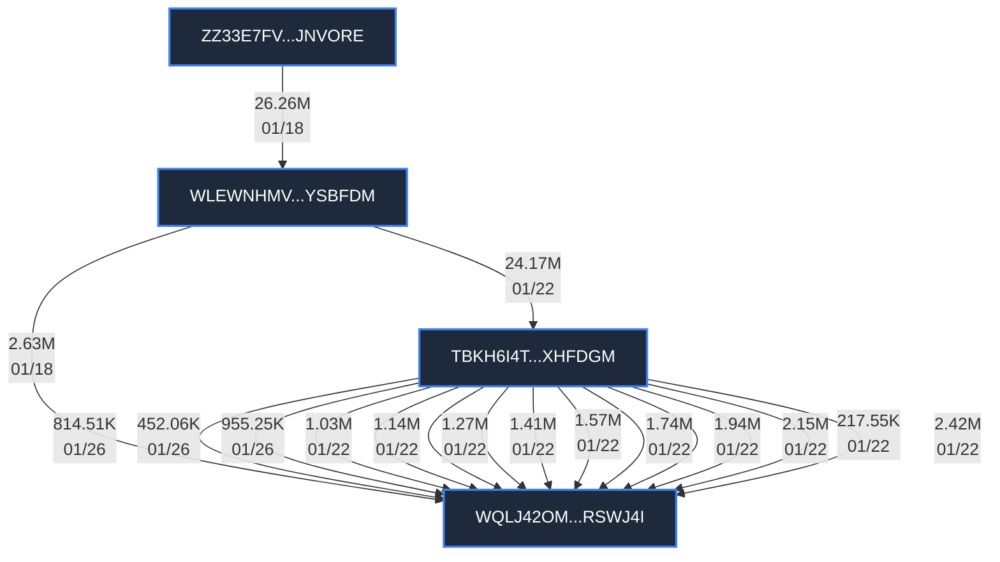

```mermaid
graph TD
    N0["ZZ33E7FV...JNVORE"]
    N1["WLEWNHMV...YSBFDM"]
    N2["TBKH6I4T...XHFDGM"]
    N3["WQLJ42OM...RSWJ4I"]

    N0 -->|26.26M<br/>01/18| N1
    N1 -->|24.17M<br/>01/22| N2
    N1 -->|2.63M<br/>01/18| N3
    N2 -->|814.51K<br/>01/26| N3
    N2 -->|452.06K<br/>01/26| N3
    N2 -->|955.25K<br/>01/26| N3
    N2 -->|1.03M<br/>01/22| N3
    N2 -->|1.14M<br/>01/22| N3
    N2 -->|1.27M<br/>01/22| N3
    N2 -->|1.41M<br/>01/22| N3
    N2 -->|1.57M<br/>01/22| N3
    N2 -->|1.74M<br/>01/22| N3
    N2 -->|1.94M<br/>01/22| N3
    N2 -->|2.15M<br/>01/22| N3
    N2 -->|217.55K<br/>01/22| N3
    N2 -->|2.42M<br/>01/22| N3

    classDef default fill:#1e293b,stroke:#3b82f6,stroke-width:2px,color:#fff
```

