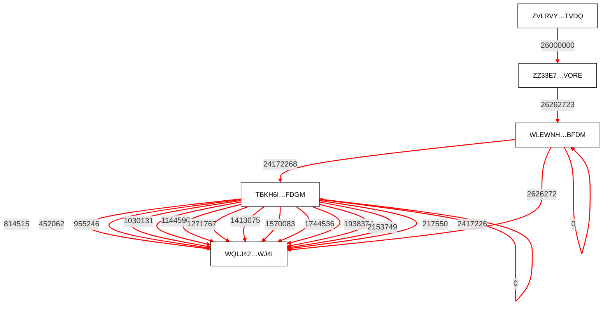

```mermaid
flowchart TD

N0["TBKH6I…FDGM"]
N1["WLEWNH…BFDM"]
N2["WQLJ42…WJ4I"]
N3["ZVLRVY…TVDQ"]
N4["ZZ33E7…VORE"]

N3 -->|"26000000"| N4
N4 -->|"26262723"| N1
N1 -->|"24172268"| N0
N1 -->|"2626272"| N2
N1 -->|"0"| N1
N0 -->|"814515"| N2
N0 -->|"452062"| N2
N0 -->|"955246"| N2
N0 -->|"1030131"| N2
N0 -->|"1144590"| N2
N0 -->|"1271767"| N2
N0 -->|"1413075"| N2
N0 -->|"1570083"| N2
N0 -->|"1744536"| N2
N0 -->|"1938374"| N2
N0 -->|"2153749"| N2
N0 -->|"217550"| N2
N0 -->|"2417226"| N2
N0 -->|"0"| N0

classDef wallet fill:#ffffff,stroke:#000000,color:#000000,font-size:14px;
class N0,N1,N2,N3,N4 wallet;
linkStyle default stroke:#ff0000,stroke-width:2px;
```

