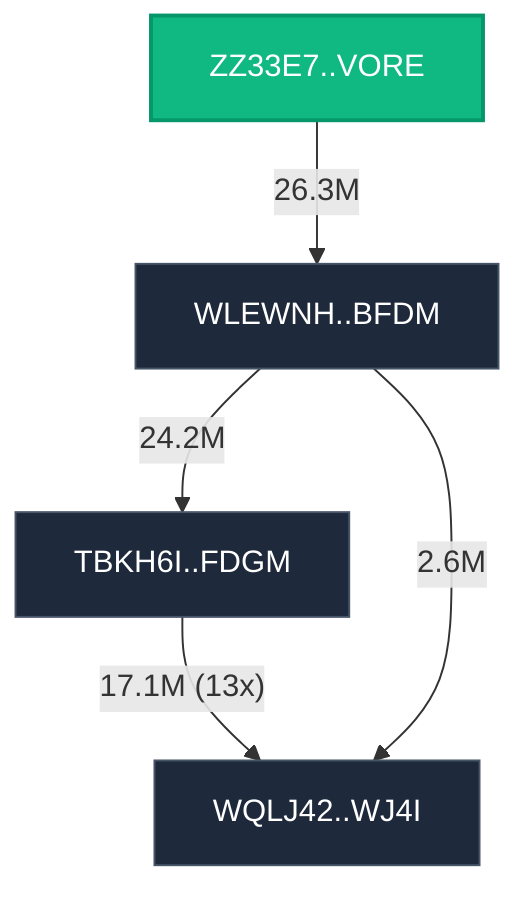

## Address Reference

- **N0**: `ZZ33E7FV5POGBZWMADNQSZT6I6PXRDTUAWEDGDYPFJDTZMOQZW7PJNVORE`
- **N1**: `WLEWNHMVSVE6EGMMN7FT6N5K2ZLLXSZIOKNANJFLSTER5JNNWNLSYSBFDM`
- **N2**: `TBKH6I4TIKO6OV35BBFB74SGPUGGPZ7QINKPNLSVG24OR5IUKHDIXHFDGM`
- **N3**: `WQLJ42OMKFOYGEWIPMEK3P4QP63DRIOJ5ADC7L3LIOPJFPV7BG2YRSWJ4I`
