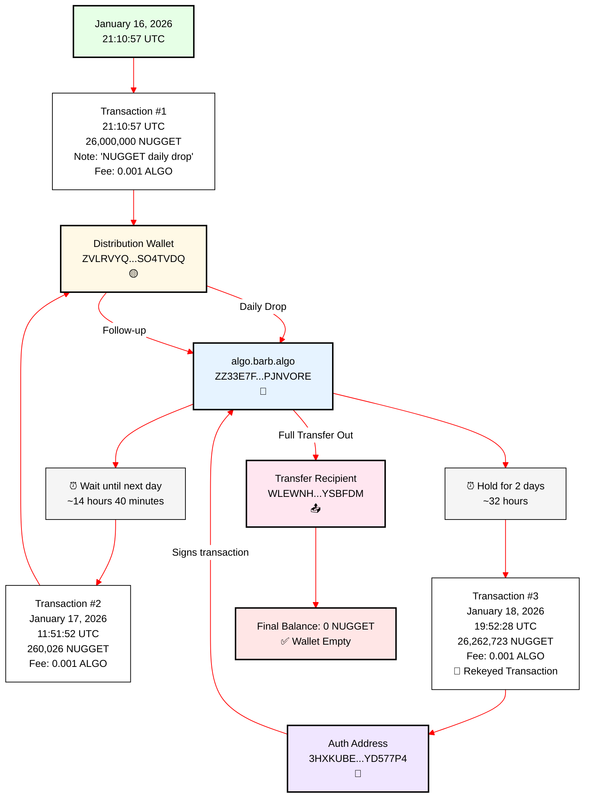

```mermaid
%%{init: {'theme':'base', 'themeVariables': {'primaryColor':'#ffffff','primaryTextColor':'#000000','primaryBorderColor':'#000000','lineColor':'#ff0000','secondaryColor':'#ffffff','tertiaryColor':'#ffffff','fontSize':'14px'}}}%%
flowchart TD
    Start["January 16, 2026<br/>21:10:57 UTC"]
    
    DistWallet["Distribution Wallet<br/>ZVLRVYQ...SO4TVDQ<br/>🟡"]
    
    AlgoBarb["algo.barb.algo<br/>ZZ33E7F...PJNVORE<br/>🎯"]
    
    Recipient["Transfer Recipient<br/>WLEWNH...YSBFDM<br/>📤"]
    
    AuthAddr["Auth Address<br/>3HXKUBE...YD577P4<br/>🔐"]
    
    Start --> Tx1["Transaction #1<br/>21:10:57 UTC<br/>26,000,000 NUGGET<br/>Note: 'NUGGET daily drop'<br/>Fee: 0.001 ALGO"]
    
    Tx1 --> DistWallet
    DistWallet -->|"Daily Drop"| AlgoBarb
    
    AlgoBarb --> Wait1["⏰ Wait until next day<br/>~14 hours 40 minutes"]
    
    Wait1 --> Tx2["Transaction #2<br/>January 17, 2026<br/>11:51:52 UTC<br/>260,026 NUGGET<br/>Fee: 0.001 ALGO"]
    
    Tx2 --> DistWallet
    DistWallet -->|"Follow-up"| AlgoBarb
    
    AlgoBarb --> Wait2["⏰ Hold for 2 days<br/>~32 hours"]
    
    Wait2 --> Tx3["Transaction #3<br/>January 18, 2026<br/>19:52:28 UTC<br/>26,262,723 NUGGET<br/>Fee: 0.001 ALGO<br/>🔐 Rekeyed Transaction"]
    
    Tx3 --> AuthAddr
    AuthAddr -->|"Signs transaction"| AlgoBarb
    AlgoBarb -->|"Full Transfer Out"| Recipient
    
    Recipient --> End["Final Balance: 0 NUGGET<br/>✅ Wallet Empty"]
    
    style DistWallet fill:#fff9e6,stroke:#000000,stroke-width:2px,color:#000000
    style AlgoBarb fill:#e6f3ff,stroke:#000000,stroke-width:2px,color:#000000
    style Recipient fill:#ffe6f0,stroke:#000000,stroke-width:2px,color:#000000
    style AuthAddr fill:#f0e6ff,stroke:#000000,stroke-width:2px,color:#000000
    style Tx1 fill:#ffffff,stroke:#000000,stroke-width:1px,color:#000000
    style Tx2 fill:#ffffff,stroke:#000000,stroke-width:1px,color:#000000
    style Tx3 fill:#ffffff,stroke:#000000,stroke-width:1px,color:#000000
    style Start fill:#e6ffe6,stroke:#000000,stroke-width:2px,color:#000000
    style End fill:#ffe6e6,stroke:#000000,stroke-width:2px,color:#000000
    style Wait1 fill:#f5f5f5,stroke:#000000,stroke-width:1px,color:#000000
    style Wait2 fill:#f5f5f5,stroke:#000000,stroke-width:1px,color:#000000
```
