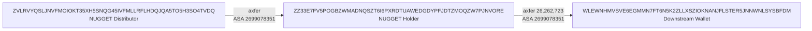

```mermaid
flowchart LR

    SRC["ZVLRVYQSLJNVFMOIOKT35XH5SNQG45IVFMLLRFLHDQJQA5TO5H3SO4TVDQ<br/>NUGGET Distributor"]

    WALLET["ZZ33E7FV5POGBZWMADNQSZT6I6PXRDTUAWEDGDYPFJDTZMOQZW7PJNVORE<br/>NUGGET Holder"]

    OUT["WLEWNHMVSVE6EGMMN7FT6N5K2ZLLXSZIOKNANJFLSTER5JNNWNLSYSBFDM<br/>Downstream Wallet"]

    SRC -->|axfer<br/>ASA 2699078351| WALLET
    WALLET -->|axfer 26,262,723<br/>ASA 2699078351| OUT
```
